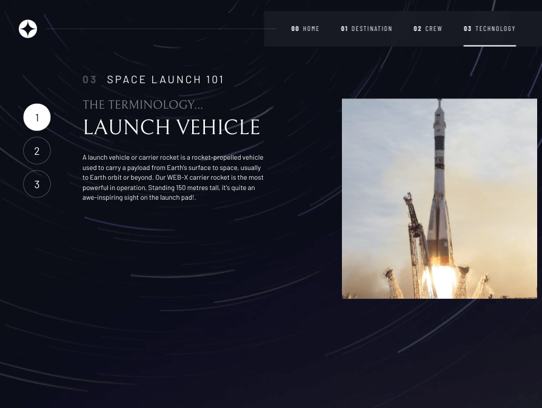
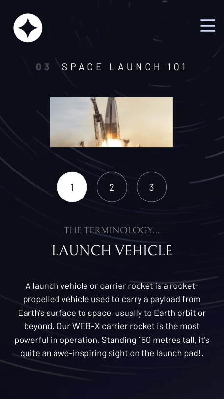

# Frontend Mentor - Space tourism website solution

This is a solution to the [Space tourism website challenge on Frontend Mentor](https://www.frontendmentor.io/challenges/space-tourism-multipage-website-gRWj1URZ3). Frontend Mentor challenges help you improve your coding skills by building realistic projects. 

## Table of contents

- [Overview](#overview)
  - [The challenge](#the-challenge)
  - [Screenshot](#screenshot)
  - [Links](#links)
- [My process](#my-process)
  - [Built with](#built-with)
  - [What I learned](#what-i-learned)
  - [Continued development](#continued-development)
  - [Useful resources](#useful-resources)
- [Acknowledgments](#acknowledgments)

## Overview

### The challenge

Users should be able to:

- View the optimal layout for each of the website's pages depending on their device's screen size
- See hover states for all interactive elements on the page
- View each page and be able to toggle between the tabs to see new information

### Screenshot

### Links

- Live Site URL: [Github Pages](https://jdegand.github.io/space-tourism-website)

## My process

### Built with

- Semantic HTML5 markup
- CSS custom properties
- Flexbox
- CSS Grid
- Mobile-first workflow

### What I learned

I actually wanted to complete this without deviating too much.  I need to improve my accessibility and add to my baseline performance.

- A Few Takeaways:
  - You can have multiple headers on a page.
  - Put images inside a div.  The div will be the flex item.  Flex on images === bugs.
  - Don't break up headlines just to make styling easier.  Use spans and work around it. 
  - Subtitles should use a paragraph tag.
  - Grid is a inner display value.
  - Viewport units don't response to zooming in and out.
  - @supports requires both property and value - even if value is overridden immediately.
  - To toggle a nav, you generally use attributes or a class.
  - Remember, data-attributes are 'strings'.
  - You can't animate background images.
  - In keyboard navigation, the spacebar triggers the click event.  Don't need extra event listener.
  - where/is css - where doesn't add specificity. 
  - aspect-ratio: width / height

### Continued development

- The crew page pictures might be a little too large.  
- I had issues with using hidden on a picture element.  I created a utility class of d-none to hide the content instead. 
- Use data.json() and fetch data from it when user click link to page / tab.
- Adjust padding / gaps to ensure everything fits into viewport height.  No more scrollbar.  
- Technology page only has mobile and desktop pictures.  Not webp either.  Thus, tablet view is compromised. 

### Useful resources

- [Free Code Camp](https://www.freecodecamp.org/news/glassmorphism-design-effect-with-html-css/) - Glass Morphism
- [MDN Docs](https://developer.mozilla.org/en-US/docs/Web/CSS/@supports) - @supports()
- [MDN Docs](https://developer.mozilla.org/en-US/docs/Web/CSS/:focus-visible) - :focus-visible
- [MDN Docs](https://developer.mozilla.org/en-US/docs/Web/CSS/margin-block) - margin-block
- [MDN Docs](https://developer.mozilla.org/en-US/docs/Web/API/Element/setAttribute) - setAttribute("name", "value")

## Acknowledgments

- Kevin Powell
- Scrimba
- Frontend Mentor